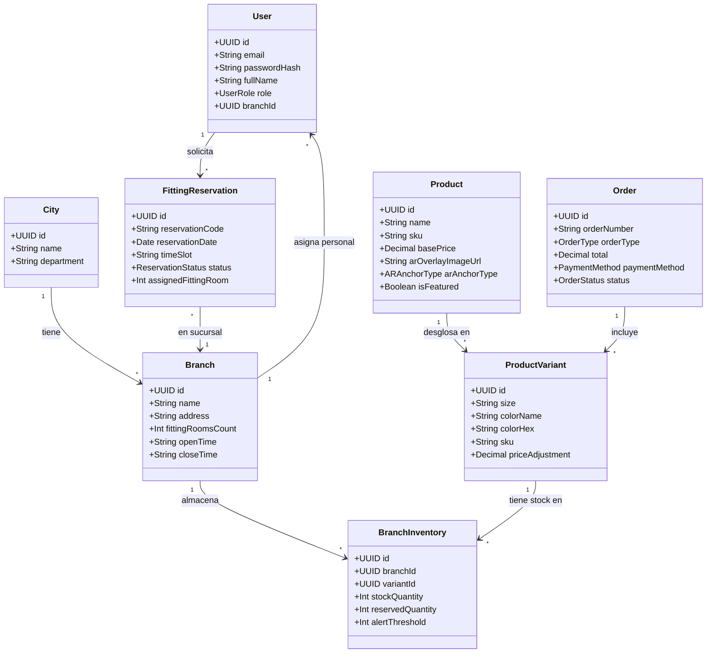
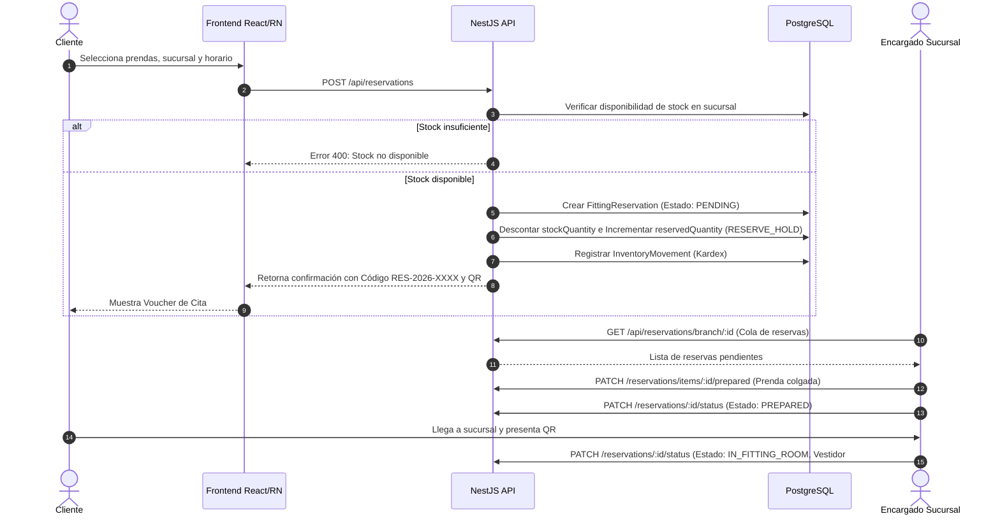
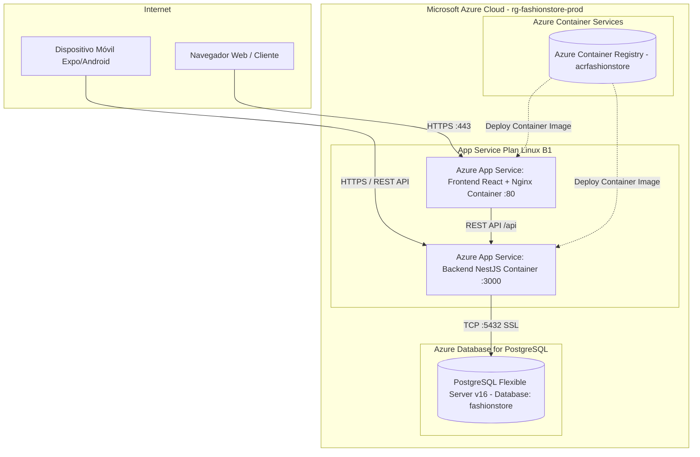

# DOCUMENTACIÓN DEL PROYECTO: PLATAFORMA INTELIGENTE FASHIONSTORE

**Materia:** Sistemas II  
**Docente:** MSc. Ing. Angélica Garzón Cuéllar  
**Plataforma:** FashionStore — Comercio Electrónico Omnicanal con Vestidores Virtuales AR e IA  
**Stack Implementado:** NestJS (Backend), React (Web), React Native (Móvil), PostgreSQL (Base de Datos), Azure (Despliegue en la Nube).

---

# 1. PERFIL DEL PROYECTO

## 1.1 Introducción
En la industria textil y de venta de indumentaria al por menor (*retail* de moda), la experiencia del cliente es el factor determinante para la decisión de compra. Tradicionalmente, el comercio electrónico convencional presenta una alta tasa de devoluciones y fricción debido a la incertidumbre del cliente respecto a cómo lucirá una prenda en su silueta, su caída y la selección de la talla adecuada.

**FashionStore** es una plataforma inteligente omnicanal de comercio electrónico concebida para superar esta limitación mediante la integración de **Realidad Aumentada (AR)** para vestidores virtuales, **Inteligencia Artificial (IA)** para recomendaciones personalizadas de estilo, y una **arquitectura distribuida** que sincroniza en tiempo real las ventas digitales con las operaciones de sucursales físicas distribuidas en múltiples ciudades (Santa Cruz, La Paz, Cochabamba).

## 1.2 Objetivo General
Desarrollar una plataforma inteligente de comercio electrónico omnicanal para una cadena de tiendas de ropa, que integre aplicaciones web y móvil, vestidores virtuales mediante Realidad Aumentada, reservas de probadores físicos en sucursales, control automatizado de inventarios por variación de prenda, puntos de venta en caja (POS), pasarelas de pago digitales e inteligencia artificial generativa.

## 1.3 Objetivos Específicos
1. Diseñar e implementar un backend robusto y modular con **NestJS**, documentado bajo el estándar OpenAPI (Swagger) y protegido mediante JSON Web Tokens (JWT) y control de acceso basado en roles (RBAC).
2. Modelar una base de datos relacional en **PostgreSQL** con TypeORM para administrar la trazabilidad de inventarios (Kardex), sucursales, pedidos y citas en vestidores físicos.
3. Desarrollar una aplicación web interactiva en **React** que permita a clientes consultar catálogo en tiempo real con stock local, utilizar el vestidor virtual AR mediante cámara web, agendar citas en tienda y procesar compras en línea.
4. Implementar los módulos operativos para el personal de sucursal: Punto de Venta (POS) para cajeros con emisión de comprobantes, y panel de atención para encargados de sucursal con checklist de preparación de percheros.
5. Desarrollar la aplicación móvil nativa con **React Native (Expo)** incorporando la cámara del dispositivo móvil para proyectar prendas con Realidad Aumentada y mostrar pases QR de reserva.
6. Integrar un motor de Inteligencia Artificial para asesoramiento de imagen (chatbot estilista) y análisis generativo de rendimiento comercial.
7. Configurar la infraestructura de contenedorización (Docker) y automatización para su despliegue en la nube de **Microsoft Azure**.

## 1.4 Descripción del Problema
Las cadenas de moda contemporáneas enfrentan dos desafíos críticos:
- **Desconexión entre canales físicos y digitales:** El cliente en la tienda física no suele tener acceso a la visibilidad global de tallas y colecciones de otras sucursales, mientras que el cliente web experimenta desconfianza sobre la talla o calce de la prenda antes de comprarla.
- **Congestión e ineficiencia en probadores físicos:** En horas pico, los clientes pierden tiempo esperando probadores o buscando prendas desordenadas en tienda.
- **Inconsistencia de inventario:** La falta de actualización en tiempo real genera sobreventa de productos o diferencias entre el stock digital y físico.

## 1.5 Alcance del Proyecto
El sistema abarca:
- **Módulo de Autenticación y Autorización:** Roles diferenciados para Cliente, Cajero, Encargado de Sucursal, Administrador y Proveedor.
- **Módulo de Catálogo y Temporadas:** Gestión jerárquica de Categorías, Temporadas (Primavera-Verano, Otoño-Invierno), Colecciones, Proveedores, Prendas y Variantes (Talla/Color).
- **Módulo de Sucursales e Inventarios:** Stock disponible y reservado por sucursal física, con registro histórico de movimientos (Kardex).
- **Módulo de Vestidor Virtual AR (Web y Móvil):** Superposición de prendas mediante cámara en tiempo real con anclaje de posición y calibración de escala.
- **Módulo de Reservas de Probador:** Agenda con franjas horarias y emisión de código/QR de reserva para preparación de prendas en sucursal.
- **Módulo de Pagos y Ventas:** Venta online con pasarela simulada (Tarjeta y QR Simple) y venta presencial en caja (POS).
- **Módulo de Inteligencia Artificial:** Asistente de moda virtual y generación de reportes ejecutivos.
- **Despliegue:** Preparado para Microsoft Azure (App Service, Azure Database for PostgreSQL y Container Registry).

---

# 2. PARTE I — FUNDAMENTACIÓN TEÓRICA

## 2.1 Comercio Electrónico (E-commerce)
El comercio electrónico comprende la compra, venta y distribución de bienes y servicios a través de redes telemáticas. En el ámbito minorista moderno se distinguen dos perspectivas:

### a) Perspectiva de Usuario (Casos de Éxito Globales)
- **Amazon:** Pionero en personalización algorítmica, logística predictiva, pagos en un clic y recomendaciones basadas en filtrado colaborativo e historial de navegación.
- **Alibaba / AliExpress:** Plataforma de escala global orientada al comercio B2B y B2C con fuerte soporte de escrow (pagos retenidos hasta conformidad) y red logística internacional.
- **Shopify:** Plataforma de comercio electrónico como servicio (SaaS) que permite a marcas independientes crear tiendas digitales con pasarelas integradas y seguimiento de carritos abandonados.

### b) Perspectiva de Desarrollo (Plataformas Tradicionales vs. Soluciones a Medida)
- **Magento (Adobe Commerce):** Solución empresarial de código abierto en PHP/MySQL de alta potencia pero pesada infraestructura y curva de aprendizaje compleja.
- **PrestaShop:** Plataforma modular en PHP adecuada para tiendas pequeñas/medianas en Europa y Latinoamérica.
- **WooCommerce:** Plugin para WordPress ampliamente utilizado por su rapidez de montaje, pero con limitaciones de escalabilidad transaccional en operaciones multitienda complejas.
> *Nota del Proyecto:* Para FashionStore se descartó el uso de plataformas empaquetadas (CMS/e-commerce) para desarrollar una arquitectura moderna desacoplada (**NestJS API + React SPA + React Native Mobile**), garantizando total control sobre el algoritmo de Realidad Aumentada y la lógica de vestidores físicos.

## 2.2 Pasarelas de Pago Electrónico
Una pasarela de pago es un servicio de intermediación financiera que cifra y valida la información de pago entre el comprador, el comercio y la red bancaria adquiriente.
- **Tarjetas de Débito y Crédito:** Procesadas mediante protocolos de seguridad PCI-DSS y tokenización (ej. Stripe), verificando fondos, fecha de expiración y código de seguridad (CVV).
- **Cobro por QR Simple (Interbancario):** Enfoque dominante en el sistema financiero boliviano y latinoamericano, basado en transferencias inmediatas respaldadas por códigos QR interoperables con confirmación bancaria automática.
- **Pasarela Libélula:** Solución boliviana orientada al cobro multicanal que integra tarjetas Visa/Mastercard, transferencias bancarias y QR Simple en una sola API para e-commerce local.
- **Stripe & PayPal:** Estándares internacionales de procesamiento de pagos con soporte de múltiples monedas, prevención de fraude basada en aprendizaje automático (*Stripe Radar*) y webhooks asíncronos.

## 2.3 Servicios de Entrega (*Deliverys*)
Los servicios de entrega de última milla (como Yaigo, Yummy, PedidosYa) calculan la tarifa de envío considerando:
1. **Distancia física:** Calculada mediante APIs geoespaciales (coordenadas de la sucursal de origen hasta el domicilio del comprador).
2. **Dimensiones y peso del paquete:** Tarifa base para prendas ligeras con recargos por volumen.
3. **Franja horaria y demanda dinámica:** Recargos en horarios pico o condiciones climáticas complejas.
4. **Tarifa plana urbana:** Tarifa fija para radio de cobertura primaria (ej. $5 USD / 25 Bs. en radio de 8 km).

## 2.4 Proceso Unificado de Desarrollo de Software (PUDS)
El PUDS es un marco de proceso de desarrollo de software iterativo e incremental, guiado por casos de uso y centrado en la arquitectura. Se estructura en cuatro fases:
1. **Inicio (*Inception*):** Definición del alcance, viabilidad técnica y estimación de recursos.
2. **Elaboración (*Elaboration*):** Análisis de requisitos, mitigación de riesgos críticos y establecimiento de la línea base arquitectónica.
3. **Construcción (*Construction*):** Desarrollo iterativo del código, base de datos y componentes funcionales.
4. **Transición (*Transition*):** Despliegue en entornos de producción (Azure), pruebas con usuarios y ajustes finales.

## 2.5 Lenguaje Unificado de Modelado (UML 2.5+)
UML es el estándar internacional para especificar, visualizar, construir y documentar artefactos de sistemas de software. Permite modelar:
- **Estructura:** Diagramas de Clases, Diagramas de Componentes y Diagramas de Despliegue.
- **Comportamiento:** Diagramas de Casos de Uso, Diagramas de Secuencia y Diagramas de Estados.

---

# 3. PARTE II — PROCESO DE DESARROLLO Y MODELADO UML

## 3.1 Captura de Requisitos

### Requisitos Funcionales Esenciales
- **RF01:** Registro e inicio de sesión de clientes y personal con JWT.
- **RF02:** Administración de roles: Cliente, Cajero, Encargado, Administrador, Proveedor.
- **RF03:** Gestión de múltiples ciudades y sucursales.
- **RF04-RF06:** Catálogo de prendas, categorías, temporadas, colecciones y proveedores.
- **RF07-RF08:** Consulta de catálogo y verificación de stock local en la sucursal seleccionada.
- **RF09-RF12:** Creación y seguimiento de reservas de probador con horario y código único.
- **RF13:** Vestidor virtual interactivo vía Realidad Aumentada (cámara y calibración).
- **RF14-RF16:** Carrito de compras y checkout digital web y móvil.
- **RF17-RF18:** Módulo POS presencial para cajero con comprobante inmediato.
- **RF19-RF21:** Pasarela de pagos y actualización automática de existencias tras ventas o reservas.
- **RF22:** Registro de movimientos de inventario (Kardex: compras, ventas, traspasos).
- **RF24-RF25:** Dashboards analíticos y generación de reportes con IA.

### Requisitos No Funcionales
- **RNF01 (Seguridad):** Cifrado de contraseñas con `bcrypt` (10 rounds) y tokens JWT con expiración configurable.
- **RNF02 (Rendimiento):** Consultas indexadas por sucursal y variante con tiempo de respuesta < 150 ms.
- **RNF03 (Escalabilidad):** Backend desacoplado en contenedores Docker listo para Azure App Service.
- **RNF04 (Usabilidad):** Interfaz web y móvil con diseño de alta costura, modo oscuro y responsive design.

---

## 3.2 Modelado UML

### Diagrama de Casos de Uso General (UML)

```mermaid
left to right direction

actor "Cliente" as Cl
actor "Cajero" as Cj
actor "Encargado de Sucursal" as Enc
actor "Administrador" as Adm
actor "Pasarela de Pagos" as PP
actor "Servicio IA" as SIA

rectangle "FashionStore System" {
  usecase "CU01: Consultar Catálogo y Stock por Sucursal" as CU01
  usecase "CU02: Probar Prenda en Vestidor AR" as CU02
  usecase "CU03: Reservar Vestidor Físico" as CU03
  usecase "CU04: Comprar Prenda Online" as CU04
  usecase "CU05: Registrar Venta POS en Caja" as CU05
  usecase "CU06: Preparar Perchero de Reserva" as CU06
  usecase "CU07: Controlar Inventario y Kardex" as CU07
  usecase "CU08: Consultar Asesor de Moda IA" as CU08
  usecase "CU09: Generar Reporte Ejecutivo IA" as CU09
  usecase "CU10: Procesar Transacción Financiera" as CU10
}

Cl --> CU01
Cl --> CU02
Cl --> CU03
Cl --> CU04
Cl --> CU08

Cj --> CU05
CU05 ..> CU07 : <<include>>

Enc --> CU06
Enc --> CU07

Adm --> CU07
Adm --> CU09

CU04 ..> CU10 : <<include>>
CU10 --> PP

CU08 --> SIA
CU09 --> SIA
```

---

### Diagrama de Clases del Dominio (UML)



---

### Diagrama de Secuencia: Reserva de Vestidor Físico con Bloqueo de Stock



---

## 3.3 Diagrama de Despliegue en la Nube de Azure (UML)



---

# 4. PARTE III — MANUAL DE INSTALACIÓN Y EJECUCIÓN

### Requisitos Previos
- Node.js versión 20+ o 24+ LTS.
- PostgreSQL en puerto local 5432 (o credenciales de Azure).
- Git instalado.

### 1. Puesta en Marcha del Backend (NestJS)
```bash
cd backend
npm install
npm run start:dev
```
- API REST: `http://localhost:3000/api`
- Documentación Swagger: `http://localhost:3000/api/docs`

### 2. Puesta en Marcha del Frontend Web (React)
```bash
cd frontend
npm install
npm run dev
```
- Interfaz en el navegador: `http://localhost:5173/`

### 3. Puesta en Marcha de la App Móvil (React Native)
```bash
cd mobile
npm install
npx expo start
```
- Escanear el código QR con la app **Expo Go** en Android/iOS para probar la cámara y realidad aumentada.
