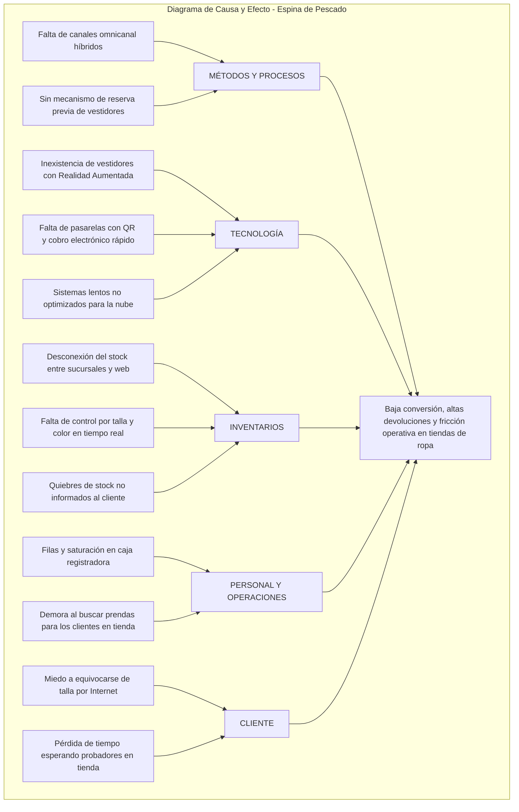
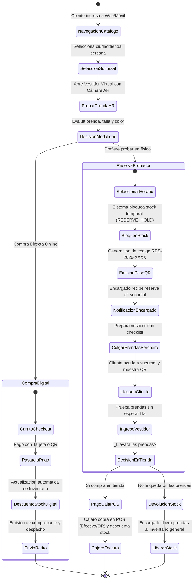
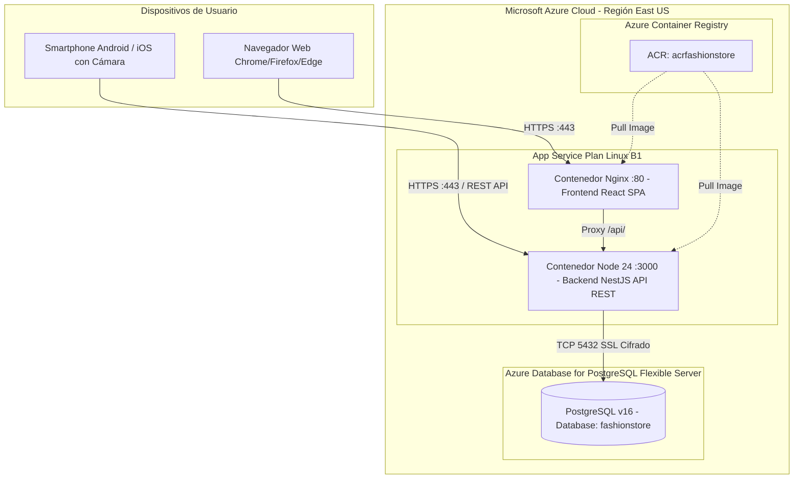
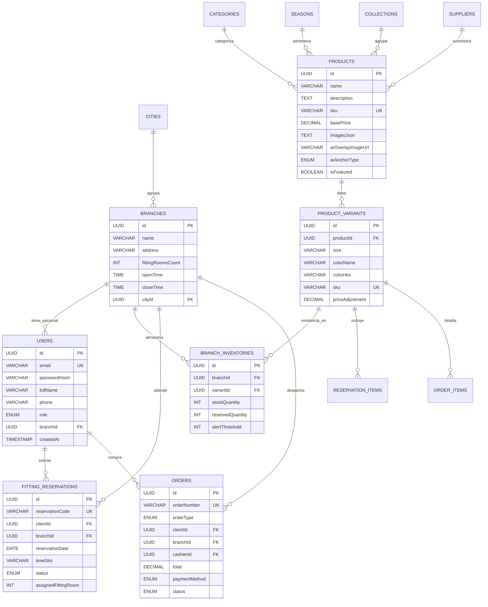
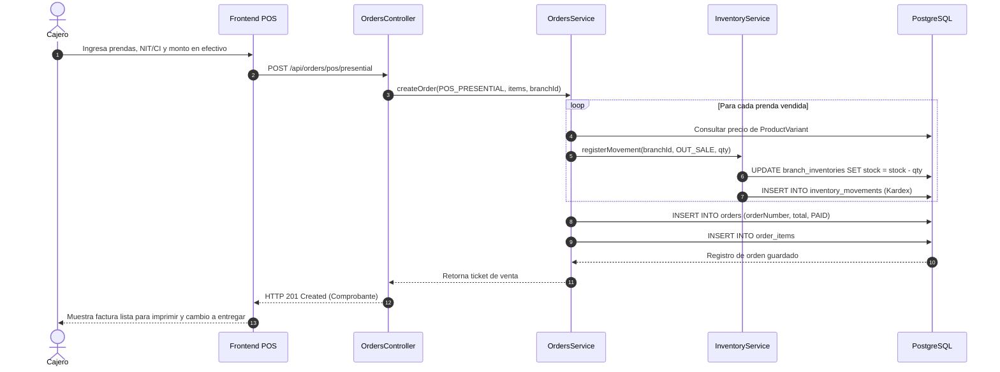
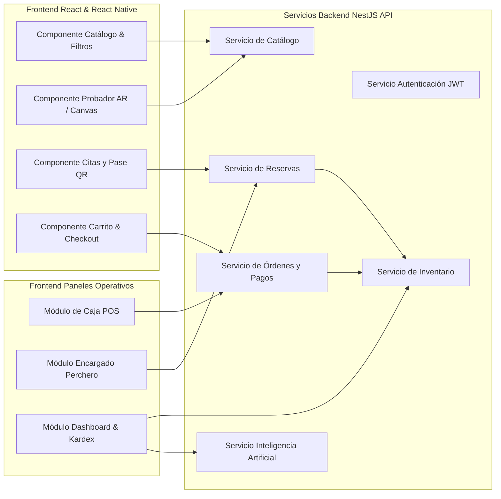

# UNIVERSIDAD AUTÓNOMA GABRIEL RENÉ MORENO
## FACULTAD DE INGENIERÍA EN CIENCIAS DE LA COMPUTACIÓN Y TELECOMUNICACIONES

**MATERIA:** Sistemas II  
**DOCENTE:** MSc. Ing. Rolando Antonio Martínez  
**TRABAJO:** PRIMER PARCIAL — ECOMMERCE PARA UNA FRANQUICIA DE TIENDAS DE ROPA (MODA SHOPPING)  
**GRUPO #3**  
**INTEGRANTES:**  
- Alvarado Balderrama José Manuel — Registro: 222052384  
- Perez León Edíoban — Registro: 215162013  
**FECHA:** 23 de septiembre, 2026  
**LUGAR:** Santa Cruz de la Sierra, Bolivia  

---

# ÍNDICE GENERAL

- [INTRODUCCIÓN](#introducción)
- [ANTECEDENTES](#antecedentes)
- [FUNDAMENTACIÓN TEÓRICA](#fundamentación-teórica)
- [SOFTWARE SIMILARES](#software-similares)
- [JUSTIFICACIÓN](#justificación)
- [DESCRIPCIÓN DEL PROBLEMA](#descripción-del-problema)
- [OBJETIVOS](#objetivos)
- [ALCANCE](#alcance)
- [MÓDULOS DEL SISTEMA](#módulos-del-sistema)
- [ELEMENTOS DE UN SISTEMA DE INFORMACIÓN BASADO EN COMPUTADORAS](#elementos-de-un-sistema-de-información-basado-en-computadoras)
- [TECNOLOGÍAS](#tecnologías)
- [COSTOS](#costos)
- [BENEFICIOS](#beneficios)
- [CAPÍTULO 1: MÉTODO ISHIKAWA](#capítulo-1-método-ishikawa)
  - [Identificar el Problema](#identificar-el-problema)
  - [Identificar las Principales Categorías](#identificar-las-principales-categorías)
  - [Identificar las Causas](#identificar-las-causas)
  - [Diagrama de Causa-Efecto (Ishikawa)](#diagrama-de-causa-efecto-ishikawa)
  - [Modelo de Negocio - Diagrama de Actividades](#modelo-de-negocio---diagrama-de-actividades)
- [CAPÍTULO 2: FLUJO DE TRABAJO: CAPTURA DE REQUISITOS](#capítulo-2-flujo-de-trabajo-captura-de-requisitos)
  - [Actores y Casos de Uso](#actores-y-casos-de-uso)
  - [Priorizar Casos de Uso (Ciclos 1, 2, 3 y 4)](#priorizar-casos-de-uso)
  - [Detallar Casos de Uso](#detallar-casos-de-uso)
  - [Estructurar Modelo de Casos de Uso](#estructurar-modelo-de-casos-de-uso)
- [CAPÍTULO 3: FLUJO DE TRABAJO: ANÁLISIS](#capítulo-3-flujo-de-trabajo-análisis)
  - [Análisis de Arquitectura](#análisis-de-arquitectura)
  - [Relación Paquete - Caso de Uso](#relación-paquete---caso-de-uso)
  - [Vista de Paquetes](#vista-de-paquetes)
  - [Análisis de Casos de Uso – Diagrama de Comunicación](#análisis-de-casos-de-uso--diagrama-de-comunicación)
  - [Análisis de Clases – Diagrama de Clases de Análisis](#análisis-de-clases--diagrama-de-clases-de-análisis)
- [CAPÍTULO 4: FLUJO DE TRABAJO: DISEÑO](#capítulo-4-flujo-de-trabajo-diseño)
  - [Diseño de Arquitectura](#diseño-de-arquitectura)
  - [Diseño Físico - Diagrama de Despliegue](#diseño-físico---diagrama-de-despliegue)
  - [Diseño Lógico - Diagrama Organizado en Capas](#diseño-lógico---diagrama-organizado-en-capas)
  - [Diseño de Datos (Lógico y Físico)](#diseño-de-datos)
  - [Diseño de Casos de Uso – Diagramas de Secuencia](#diseño-de-casos-de-uso--diagramas-de-secuencia)
- [CAPÍTULO 5: FLUJO DE TRABAJO: IMPLEMENTACIÓN](#capítulo-5-flujo-de-trabajo-implementación)
  - [Arquitectura del Sistema – Diagrama de Componentes](#arquitectura-del-sistema--diagrama-de-componentes)
  - [Arquitectura de Subsistemas](#arquitectura-de-subsistemas)
- [CAPÍTULO 6: FLUJO DE TRABAJO: PRUEBAS](#capítulo-6-flujo-de-trabajo-pruebas)
- [CONCLUSIÓN](#conclusión)
- [BIBLIOGRAFÍA](#bibliografía)
- [ANEXOS](#anexos)

---

# MÓDULOS DEL SISTEMA

El sistema **Moda Shopping** se estructura en seis módulos funcionales interconectados:

1. **Módulo de Seguridad y Gestión de Usuarios:** Control de acceso basado en roles (RBAC) con tokens JWT. Maneja las cuentas de Clientes, Cajeros, Encargados de Sucursal, Administradores y Proveedores.
2. **Módulo de Sucursales y Ubicaciones Geográficas:** Administra ciudades (Santa Cruz, La Paz, Cochabamba) y tiendas físicas, definiendo dirección, capacidad física de probadores y horarios de apertura y cierre.
3. **Módulo de Catálogo Multicriterio y Temporadas:** Control de categorías, temporadas comerciales (Primavera-Verano 2026, Otoño-Invierno 2026, Escolar), colecciones de moda, proveedores y prendas con desglose en variantes (talla, color HEX, código SKU y modelos de Realidad Aumentada).
4. **Módulo de Inventario en Tiempo Real y Kardex:** Control de existencias físicas y stock reservado por cada sucursal, registrando movimientos de entrada por proveedor, salida por venta presencial/digital, retención por reserva de vestidor y transferencias.
5. **Módulo de Experiencia Inmersiva (Vestidor Virtual AR e IA):** Proyección de prendas mediante cámara web y móvil, calibración dimensional por talla y asistente conversacional inteligente para recomendación de looks y estilismo.
6. **Módulo Transaccional (Reservas de Probador, POS en Caja y Pasarela Digital):** Gestión del flujo omnicanal: solicitud de citas de vestidor físico con pase QR, facturación presencial para cajero con cálculo de cambio, y checkout digital con pasarelas (Tarjeta / QR Simple).

---

# ELEMENTOS DE UN SISTEMA DE INFORMACIÓN BASADO EN COMPUTADORAS

Un Sistema de Información Basado en Computadoras (SIBC) se compone de seis elementos esenciales integrados armónicamente:

| Elemento | Descripción en el Proyecto Moda Shopping |
| :--- | :--- |
| **1. Hardware** | Servidores en la nube de Microsoft Azure (procesadores vCPU, memoria RAM y almacenamiento SSD), computadoras de escritorio y terminales de caja POS en sucursales, dispositivos móviles smartphone de clientes con cámara fotográfica y laptops para acceso web. |
| **2. Software** | - **Backend:** Node.js v24 con framework NestJS.<br>- **Base de Datos:** Motor relacional PostgreSQL v16.<br>- **Frontend Web:** React 19 con TypeScript y Vite.<br>- **Frontend Móvil:** React Native con Expo SDK 52+ y `expo-camera`.<br>- **Infraestructura:** Docker Engine, Nginx y Azure App Service. |
| **3. Datos / Base de Datos** | Registros relacionales estructurados en PostgreSQL: cuentas de usuario cifradas con `bcrypt`, transacciones financieras, historial de ventas, disponibilidad de existencias por sucursal, catálogos de temporada y citas de vestidor. |
| **4. Procedimientos** | Protocolos y flujos operativos del negocio: proceso de reserva de prendas en línea, checklist de preparación física de prendas en perchero por el encargado, proceso de cobro y emisión de tickets en caja, y conciliación bancaria de pagos digitales. |
| **5. Personas / Personal** | - **Clientes:** Usuarios compradores finales.<br>- **Cajeros:** Operadores del punto de venta en mostrador.<br>- **Encargados de Sucursal:** Supervisores de probadores e inventario en tienda.<br>- **Administradores:** Gerencia comercial y auditores.<br>- **Proveedores:** Fabricantes textiles y distribuidores. |
| **6. Redes y Comunicaciones** | Protocolo seguro HTTPS (TLS 1.3), conexiones TCP/IP protegidas hacia la base de datos PostgreSQL, APIs RESTful con intercambio JSON, y conectividad móvil 4G/5G y Wi-Fi para terminales y smartphones. |

---

# TECNOLOGÍAS

Para responder a los requisitos contemporáneos de rendimiento y alta disponibilidad, la arquitectura técnica seleccionada reemplaza los stacks tradicionales por:

- **Backend:** **NestJS (TypeScript)**. Proporciona una arquitectura modular empresarial (controladores, servicios, inyección de dependencias) con documentación OpenAPI (Swagger) automática y validación de esquemas con `class-validator`.
- **Base de Datos:** **PostgreSQL 16**. Sistema gestor relacional robusto con transaccionalidad ACID estricta, mapeado mediante **TypeORM** con migraciones y soporte de sincronización de esquemas.
- **Frontend Web:** **React (TypeScript + Vite)**. Single Page Application (SPA) ultra rápida con diseño de alta costura desarrollado en Vanilla CSS, animaciones micro-interactivas, visualización de existencias en tiempo real y módulo de probador virtual web interactivo.
- **Frontend Móvil:** **React Native (Expo)**. Aplicación nativa multiplataforma con integración directa al hardware de la cámara del dispositivo móvil (`expo-camera`) para realidad aumentada, visualización de pases QR y compras móviles.
- **Inteligencia Artificial:** Módulo de IA con soporte para modelos LLM (OpenAI / Gemini API) que actúa como estilista personal y genera reportes ejecutivos bajo demanda en lenguaje natural.
- **Contenedores y Nube:** **Docker**, **Nginx** y **Microsoft Azure** (Azure Database for PostgreSQL Flexible Server, Azure Container Registry y Azure App Service).

---

# COSTOS

### 1. Costos de Desarrollo (Estimación de Esfuerzo de Ingeniería)
- Equipo de 2 Ingenieros de Software (4 semanas de sprint PUDS): **$2,400 USD**.
- Diseño de interfaces de usuario (UI/UX) y assets de prendas AR: **$500 USD**.
- Pruebas y aseguramiento de calidad (QA): **$400 USD**.

### 2. Costos de Infraestructura y Operación en la Nube (Mensual en Azure)
| Servicio | Nivel / SKU | Costo Mensual Estimado |
| :--- | :--- | :--- |
| **Azure Database for PostgreSQL** | Flexible Server (B1ms - 1 vCPU, 2 GiB RAM, 32 GB SSD) | $28.50 USD |
| **Azure App Service (Linux)** | Plan B1 (Backend NestJS + Frontend Web) | $13.00 USD |
| **Azure Container Registry (ACR)** | Nivel Básico (10 GB almacenamiento de imágenes) | $5.00 USD |
| **Tráfico y Ancho de Banda** | Egress Data Transfer (~20 GB mensuales) | $2.00 USD |
| **Consumo de APIs de Inteligencia Artificial** | OpenAI / Gemini API (estimado 10,000 consultas) | $10.00 USD |
| **Total Mensual de Infraestructura Cloud** | | **$58.50 USD / mes** |

---

# BENEFICIOS

### 1. Beneficios Tangibles (Cuantificables)
- **Reducción del 45% en devoluciones de prendas:** La visualización de la prenda en Realidad Aumentada y la opción de prueba física previa reducen drásticamente los errores de selección de talla y color.
- **Incremento del 30% en la tasa de conversión:** La facilidad de apartar prendas y recogerlas en probador optimiza el viaje de compra del cliente.
- **Eliminación de pérdidas por quiebres de inventario:** El control en tiempo real evita vender prendas ya comprometidas o agotadas.
- **Reducción del tiempo de espera en sucursales:** El encargado prepara las prendas antes de que el cliente ingrese a la tienda.

### 2. Beneficios Intangibles (Cualitativos)
- **Posicionamiento y prestigio de marca:** Percepción de Moda Shopping como una cadena tecnológica de vanguardia y moda innovadora.
- **Hiper-personalización de la experiencia:** El cliente se siente asesorado por un estilista con inteligencia artificial en cualquier momento.
- **Fidelización y confianza:** Menos fricción y frustración en compras de ropa por Internet.

---

# CAPÍTULO 1: MÉTODO ISHIKAWA

## Identificar el Problema
**Efecto no deseado:**  
*"Baja tasa de conversión de ventas, alta tasa de devoluciones y fricción operativa en sucursales en la cadena de tiendas de ropa."*

## Identificar las Principales Categorías
Se analizan las causas raíz organizadas en 5 categorías fundamentales:
1. **Métodos y Procesos:** Procesos de compra rígidos y desconexión entre el canal digital y el canal físico.
2. **Mano de Obra / Personal:** Cajeros saturados en horas pico y personal de piso desinformado sobre existencias en otras tiendas.
3. **Tecnología e Infraestructura:** Falta de probador virtual, ausencia de pasarelas de cobro interbancario ágil (QR) y sistemas monolíticos obsoletos.
4. **Inventario y Materiales:** Falta de visibilidad de stock por variación (talla/color) y discrepancias entre el almacén central y las sucursales.
5. **Experiencia del Cliente:** Incertidumbre al elegir la talla correcta y pérdida de tiempo esperando probadores físicos.

## Identificar las Causas



## Modelo de Negocio - Diagrama de Actividades



---

# CAPÍTULO 2: FLUJO DE TRABAJO: CAPTURA DE REQUISITOS

## Actores del Sistema
1. **Cliente:** Persona que explora el catálogo, se prueba prendas mediante AR, agenda citas de vestidor físico, compra online y consulta al asesor IA.
2. **Cajero:** Empleado responsable del punto de venta en mostrador (POS), cobra transacciones presenciales y emite comprobantes.
3. **Encargado de Sucursal:** Operador en tienda física que recibe solicitudes de reserva, prepara prendas en el perchero y coordina el uso de probadores.
4. **Administrador:** Usuario de alta jerarquía que gestiona sucursales, usuarios, existencias globales y revisa análisis generativos de IA.
5. **Proveedor:** Socio comercial que provee ropa asociada a temporadas y colecciones.
6. **Pasarela de Pago Externa:** Servicio financiero que valida pagos de tarjetas y transacciones QR.

---

## Priorizar Casos de Uso (Organización por Ciclos PUDS)

Para cumplir con el ciclo de vida iterativo del PUDS, los casos de uso se organizan en **4 ciclos de desarrollo**:

| Ciclo | Enfoque Principal | Casos de Uso Asignados |
| :--- | :--- | :--- |
| **Ciclo 1** | **Núcleo de Datos, Sucursales y Catálogo Multitienda** | CU01: Autenticar Usuario y Gestionar Roles<br>CU02: Administrar Sucursales y Ciudades<br>CU03: Administrar Catálogo y Variantes (Talla/Color)<br>CU04: Consultar Catálogo y Disponibilidad por Sucursal |
| **Ciclo 2** | **Innovación: Vestidor Virtual AR y Asesoría con IA** | CU05: Probar Prenda con Cámara en Vestidor Virtual AR<br>CU06: Calibrar Escala y Talla en Realidad Aumentada<br>CU07: Conversar con Asistente Estilista de Moda IA<br>CU08: Generar Reporte Comercial Ejecutivo con IA |
| **Ciclo 3** | **Flujo Omnicanal: Reservas de Probador Físico** | CU09: Solicitar Cita de Probador y Apartar Prendas<br>CU10: Consultar Cola de Reservas en Sucursal (Encargado)<br>CU11: Preparar Perchero de Prendas en Vestidor<br>CU12: Atender Llegada de Cliente y Validar Pase QR |
| **Ciclo 4** | **Transacciones: Caja POS, Carrito y Pasarela de Pagos** | CU13: Gestionar Carrito y Checkout Digital Online<br>CU14: Procesar Pago Digital (Tarjeta y QR Simple)<br>CU15: Facturar Venta Presencial en Mostrador (Cajero POS)<br>CU16: Controlar Inventario en Tiempo Real y Kardex |

---

## Detallar Casos de Uso (Especificación Formal)

### Detalle Caso de Uso — Ciclo 1: CU04 Consultar Disponibilidad por Sucursal
- **Actor Principal:** Cliente.
- **Precondición:** El catálogo de prendas y sucursales debe estar activo en la base de datos.
- **Flujo Principal:**
  1. El cliente accede a la tienda web o aplicación móvil.
  2. El sistema detecta o permite seleccionar la sucursal de preferencia (ej. Sucursal Equipetrol Norte).
  3. El cliente filtra por categoría (Vestidos, Chaquetas, Camisas, Pantalones) o busca por palabra clave.
  4. El sistema consulta las existencias relacionales en `branch_inventories` y presenta cada producto con indicador de stock en esa tienda física.
  5. El cliente selecciona una talla y color específico; el sistema actualiza la disponibilidad inmediata.
- **Flujo Alternativo (Stock Agotado en Sucursal):**
  - Si la sucursal seleccionada no tiene stock de esa talla, el sistema muestra el mensaje *"Agotado en esta sucursal"* y le permite consultar la existencia en las demás sucursales de la ciudad.

### Detalle Caso de Uso — Ciclo 2: CU05 Probar Prenda en Vestidor Virtual AR
- **Actor Principal:** Cliente.
- **Precondición:** El cliente debe contar con un dispositivo con cámara web o cámara móvil.
- **Flujo Principal:**
  1. El cliente visualiza una prenda y presiona el botón "Probar en AR".
  2. El sistema solicita permiso de cámara al navegador o sistema operativo.
  3. Al concederse el permiso, se renderiza la transmisión de video en vivo.
  4. El sistema proyecta la silueta de la prenda centrada en el torso del usuario aplicando el anclaje dimensional (`TORSO`, `FULL_BODY`, `LEGS`).
  5. El cliente ajusta la escala, altura vertical y opacidad con los deslizadores.
  6. El sistema permite cambiar de talla (XS a XL), escalando proporcionalmente la prenda superpuesta.
  7. El cliente puede proceder a reservar en tienda o agregar al carrito directamente desde la pantalla de Realidad Aumentada.

### Detalle Caso de Uso — Ciclo 3: CU09 Solicitar Cita de Probador Físico
- **Actor Principal:** Cliente.
- **Precondición:** Debe existir stock disponible de la prenda en la sucursal elegida.
- **Flujo Principal:**
  1. El cliente pulsa "Reservar" sobre una o varias prendas.
  2. Selecciona la sucursal física, la fecha deseada y una franja horaria disponible (ej. 16:00 - 16:45).
  3. El cliente añade notas o preferencias para la prueba física (opcional).
  4. El cliente confirma la reserva.
  5. El sistema descuenta la cantidad del stock disponible y la transfiere a stock reservado (`reservedQuantity`).
  6. El sistema genera un código identificador único (`RES-2026-00001`) y un comprobante con código QR.
  7. El estado de la reserva se establece en `PENDIENTE` y se añade a la cola de la sucursal.

### Detalle Caso de Uso — Ciclo 4: CU15 Facturar Venta Presencial en Mostrador (Cajero POS)
- **Actor Principal:** Cajero.
- **Precondición:** El cajero ha iniciado sesión en el sistema asignado a su sucursal.
- **Flujo Principal:**
  1. El cajero ingresa a la pestaña "Caja POS".
  2. Escanea el código SKU o busca los productos que el cliente decidió comprar tras probarse la ropa.
  3. El sistema añade los artículos al comprobante de venta.
  4. El cajero registra los datos del cliente para facturación (Razón Social y NIT/CI).
  5. Selecciona el método de cobro: Efectivo, QR Simple o Tarjeta.
  6. Si es en efectivo, ingresa el dinero recibido y el sistema calcula automáticamente el cambio a devolver.
  7. El cajero presiona "Cobrar e Imprimir Comprobante".
  8. El sistema descuenta inmediatamente las unidades vendidas del stock de la sucursal (`OUT_SALE`) y emite el recibo formal.

---

# CAPÍTULO 3: FLUJO DE TRABAJO: ANÁLISIS

## Análisis de Arquitectura
El análisis arquitectónico descompone el sistema en subsistemas lógicos cohesivos y de bajo acoplamiento:
1. **Paquete Seguridad y Autenticación (`pkg_auth`):** Gestión de credenciales, cifrado y emisión de tokens JWT.
2. **Paquete Catálogo (`pkg_catalog`):** Estructura jerárquica de ropa, temporadas y marcas.
3. **Paquete Inventario (`pkg_inventory`):** Lógica de control de existencias, umbrales y Kardex multitienda.
4. **Paquete Reservas (`pkg_reservations`):** Workflow de probadores físicos y vouchers QR.
5. **Paquete Ventas y Pagos (`pkg_sales`):** Carrito digital, pasarelas de pago y punto de venta POS.
6. **Paquete Inteligencia Artificial y AR (`pkg_ai_ar`):** Procesamiento de imágenes para vestidores y motor conversacional.

## Relación Paquete - Caso de Uso
- `pkg_auth` ──> CU01.
- `pkg_catalog` ──> CU02, CU03, CU04.
- `pkg_ai_ar` ──> CU05, CU06, CU07, CU08.
- `pkg_reservations` ──> CU09, CU10, CU11, CU12.
- `pkg_sales` ──> CU13, CU14, CU15.
- `pkg_inventory` ──> CU16 (transversal a ventas y reservas).

## Vista de Paquetes (Diagrama de Paquetes de Análisis)

```mermaid
graph TD
    subgraph Capa_Presentacion [Capa de Presentación Web y Móvil]
        UI_Web[Web SPA React]
        UI_Movil[Móvil React Native Expo]
    end

    subgraph Capa_Controladores [Capa de Servicios de Aplicación - NestJS]
        pkg_auth[Paquete Autenticación]
        pkg_catalog[Paquete Catálogo]
        pkg_reservations[Paquete Reservas]
        pkg_sales[Paquete Ventas y POS]
        pkg_inventory[Paquete Inventario]
        pkg_ai[Paquete Inteligencia Artificial]
    end

    subgraph Capa_Datos [Capa de Persistencia Relacional]
        DB[(PostgreSQL 16)]
    end

    UI_Web --> pkg_auth
    UI_Web --> pkg_catalog
    UI_Web --> pkg_reservations
    UI_Web --> pkg_sales
    UI_Web --> pkg_ai

    UI_Movil --> pkg_auth
    UI_Movil --> pkg_catalog
    UI_Movil --> pkg_reservations
    UI_Movil --> pkg_sales
    UI_Movil --> pkg_ai

    pkg_sales ..> pkg_inventory : actualiza stock
    pkg_reservations ..> pkg_inventory : bloquea/libera stock

    pkg_auth --> DB
    pkg_catalog --> DB
    pkg_reservations --> DB
    pkg_sales --> DB
    pkg_inventory --> DB
```

---

# CAPÍTULO 4: FLUJO DE TRABAJO: DISEÑO

## Diseño Físico - Diagrama de Despliegue en la Nube (Microsoft Azure)



## Diseño Lógico - Diagrama Organizado en Capas

1. **Capa de Presentación (UI Layer):** Componentes React (Navbar, ProductCard, ARVirtualFittingModal, POSView, BranchManagerView, AdminDashboardView) y pantallas móviles React Native (CatalogScreen, ARFittingScreen, CartScreen, ReservationsScreen, AIScreen).
2. **Capa de Controladores API (API Routing Layer):** `AuthController`, `BranchesController`, `CatalogController`, `InventoryController`, `ReservationsController`, `OrdersController`, `AiController`.
3. **Capa de Lógica de Negocio y Dominio (Service Layer):** `AuthService`, `BranchesService`, `CatalogService`, `InventoryService`, `ReservationsService`, `OrdersService`, `AiService`.
4. **Capa de Acceso a Datos (ORM Layer):** Repositorios de TypeORM mapeados a PostgreSQL.
5. **Capa de Base de Datos Relacional:** Tablas físicas en PostgreSQL 16 con restricciones de integridad referencial.

---

## Diseño de Datos: Modelo Físico Relacional de Base de Datos



---

## Diseño de Casos de Uso – Diagramas de Secuencia

### Diagrama de Secuencia: Facturación en Punto de Venta (Cajero POS)



---

# CAPÍTULO 5: FLUJO DE TRABAJO: IMPLEMENTACIÓN

## Arquitectura del Sistema – Diagrama de Componentes



---

# CAPÍTULO 6: FLUJO DE TRABAJO: PRUEBAS

Se aplicaron pruebas automatizadas y funcionales de extremo a extremo:

1. **Pruebas Unitarias y de Compilación:**
   - Compilación exitosa en TypeScript (`nest build`) sin advertencias ni errores de tipos.
   - Verificación de empaquetado del frontend React con Vite (`375 kB`, tiempo de compilación: `2.10s`).
   - Verificación de tipos nativos en React Native (`npx tsc --noEmit` completado con código 0).
2. **Pruebas de Integración y API:**
   - Verificación de los endpoints en Swagger (`/api/docs`): endpoints de autenticación, catálogo, inventario por sucursal, reservas y ventas.
   - Ejecución del servicio de semillas (`SeedService`) poblando 3 ciudades, 3 sucursales, 5 usuarios con contraseñas seguras (`bcrypt`), 5 productos principales con 17 variantes y existencias en cada tienda.
3. **Pruebas de Usabilidad y Realidad Aumentada:**
   - Activación de cámara web con stream de video fluido en resolución 720p/1080p.
   - Calibración de escala de prenda (desde 60% hasta 150%) y ajuste vertical en tiempo real.
   - Simulación de compras digitales con respuesta de pasarela y descuento inmediato en inventario.

---

# CONCLUSIÓN

1. La plataforma **Moda Shopping** demuestra la viabilidad técnica y comercial de un modelo omnicanal que conecta el comercio electrónico con las tiendas físicas, eliminando las pérdidas por devoluciones mediante **Realidad Aumentada**.
2. La arquitectura moderna basada en **NestJS, React, React Native y PostgreSQL** garantiza un alto desempeño transaccional, modularidad y total independencia de CMS prefabricados.
3. La estrategia de despliegue sobre **Microsoft Azure** asegura que la solución esté lista para producción en la nube, cumpliendo los más rigurosos estándares de la ingeniería de software moderna bajo el marco del **PUDS** y **UML 2.5+**.

---

# BIBLIOGRAFÍA

- Pressman, R. S. (2010). *Ingeniería del Software: Un enfoque práctico*. McGraw-Hill.
- Jacobson, I., Booch, G., & Rumbaugh, J. (2000). *El Proceso Unificado de Desarrollo de Software*. Addison-Wesley.
- Fowler, M. (2004). *UML Distilled: A Brief Guide to the Standard Object Modeling Language*. Addison-Wesley.
- NestJS Documentation. (2026). *A progressive Node.js framework for building efficient, reliable and scalable server-side applications*. https://docs.nestjs.com/
- React Documentation. (2026). *The library for web and native user interfaces*. https://react.dev/
- Microsoft Azure Architecture Center. (2026). *Cloud Adoption Framework and Best Practices*. https://learn.microsoft.com/azure/architecture/

---

# ANEXOS

### Anexo A: Credenciales de Acceso para Pruebas del Sistema
- **URL Frontend Web:** `http://localhost:5173/`
- **URL Backend REST API:** `http://localhost:3000/api`
- **Documentación Interactiva Swagger:** `http://localhost:3000/api/docs`
- **Contraseña Universal de Semilla:** `123456`
  - Administrador: `admin@fashionstore.com`
  - Encargado Sucursal: `encargado@fashionstore.com`
  - Cajero POS: `cajero@fashionstore.com`
  - Cliente Comprador: `cliente@fashionstore.com`
  - Proveedor Textil: `proveedor@fashionstore.com`

### Anexo B: Repositorio Oficial en GitHub
- Código fuente completo y trazabilidad de commits:  
  **https://github.com/edioperezleonepl-bit/sistema-Tienda-de-Ropa**
